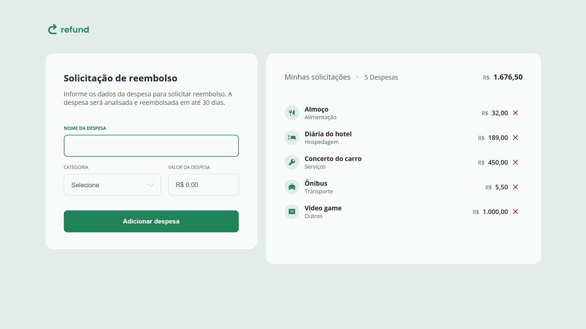

# 🚀 Refund Project 

💻 A web application for calculating refunds with a clean, interactive interface.

## 📋 Table of Contents
- [✨ Features](#features)
- [🛠️ Technologies Used](#technologies-used)
- [🏗️ Project Structure](#project-structure)
- [🚀 Getting Started](#getting-started)
- [🎨 Screenshots](#screenshots)

## ✨ Features
- 📊 Interactive refund calculator
- 🎨 Clean, responsive UI design
- 🔢 Dynamic form validation
- 💰 Real-time calculation updates
- 🌈 Modern color scheme

## 🛠️ Technologies Used
- 
- 
- 

## 🏗️ Project Structure
```
project-refund/
├── img/            # 📷 All project images
├── index.html      # 🏠 Main HTML file
├── scripts.js      # 🧠 JavaScript logic
└── styles.css      # 🎨 CSS styles
```

## 🚀 Getting Started
1. Clone this repository
2. Open `index.html` in your browser
3. Start using the refund calculator!

## 🎨 Screenshots
 *Example of the application interface*

Made with ❤️ by [Your Name]
